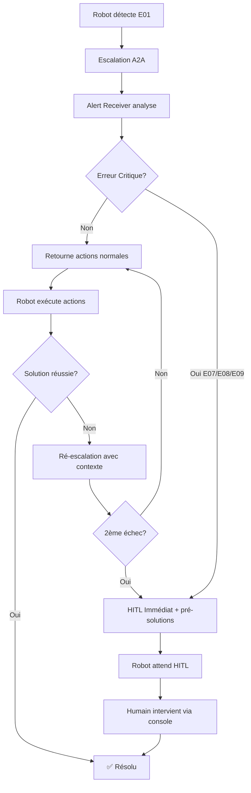

# 🤖 RoboNest - Multi-Agent Robot Support System

Système de support multi-agents pour robots utilisant **Google ADK** et le **protocole A2A** (Agent-to-Agent).

## 🎯 Vue d'Ensemble

RoboNest démontre une architecture complète de support autonome pour robots :
- **Détection automatique** d'erreurs hardware
- **Escalation intelligente** via A2A
- **Solutions structurées** retournées en JSON
- **Ré-escalation automatique** sur échec
- **Human-in-the-Loop (HITL)** pour erreurs critiques

## 🏗️ Architecture

```
┌────────────────────┐         A2A Protocol         ┌─────────────────────┐
│  Embedded Robot    │ ◄────────────────────────────► │  Alert Receiver     │
│   (port 8001)      │   Structured JSON Solutions   │   (port 8000)       │
│                    │                                │                     │
│  - Sensor Monitor  │                                │  - LlmAgent + RAG   │
│  - Error Detection │                                │  - Error Classifier │
│  - A2A Client      │                                │  - Solution Provider│
│  - Auto-Execution  │                                │  - HITL Manager     │
└────────┬───────────┘                                └──────────┬──────────┘
         │                                                       │
         │                                                  ┌────▼─────┐
         ▼                                                  │   RAG    │
┌────────────────────┐                                     │Knowledge │
│  Test Console      │                                     │   Base   │
│  (Interactive CLI) │                                     └──────────┘
└────────────────────┘
```

### Flow d'Escalation



## 🚀 Quick Start

### Installation

```bash
# Cloner le repo
git clone <repo-url>
cd robonest-system

# Installer dépendances
pip install -r requirements.txt

# Configuration
echo "GOOGLE_API_KEY=your_key_here" > .env
```

### Lancement Rapide

```bash
# Une seule commande - Lance tout le système
python start_system.py
```

Ceci démarre automatiquement :
1. Alert Receiver (port 8000)
2. Embedded Robot (port 8001)
3. Console Interactive

### Lancement Manuel

```bash
# Terminal 1: Alert Receiver
cd agents/alert_receiver
python alert_receiver_a2a.py

# Terminal 2: Robot
cd embedded_robot
python main_a2a.py

# Terminal 3: Console de test
cd embedded_robot
python simulator_console.py
```

## 🧪 Démos

### Démo 1: HITL Immédiat (E07)

```bash
# Dans la console interactive
Console: 3    # Simule E07 (Batterie critique)

# Résultat:
# - Alert Receiver détecte erreur critique
# - requires_hitl=true immédiatement
# - Robot exécute pré-solutions (cooldown, power_down)
# - waiting_for_hitl=True (pas de ré-escalation)

Console: b    # Intervention HITL (refroidir batterie)

# ✅ E07 résolu
```

### Démo 2: Ré-escalation Automatique → HITL

```bash
Console: 1    # Simule E01 (Roues bloquées)

# Résultat:
# Tentative #1: ["clean_wheels", "recalibrate_motors"]
# ❌ Échec → Ré-escalation
# 
# Tentative #2: ["inspect_wheels", "power_cycle_motors"]
# ❌ Échec → Ré-escalation critique
# 
# Tentative #3: requires_hitl=true (FORCÉ)
# Robot entre en mode attente HITL

Console: h    # Intervention HITL (débloquer roues manuellement)

# ✅ E01 résolu
```

### Démo 3: Résolution Automatique

```bash
Console: 2    # Simule E03 (Batterie faible)

# Résultat:
# - Alert Receiver propose: ["charge_battery"]
# - requires_hitl=false
# - Robot exécute automatiquement
# - Vérification après 5s
# ✅ E03 résolu sans intervention humaine
```

## 📊 Patterns Google ADK Démontrés

### Agents
- ✅ **LlmAgent** - Agent avec Gemini pour raisonnement
- ✅ **RemoteA2aAgent** - Client A2A pour communication inter-agents
- ✅ **Sequential Agent** - Orchestration séquentielle (A2A → Execute)
- ✅ **LoopAgent** - Boucle automatique avec ré-essais

### Communication
- ✅ **A2A Protocol** - Communication native agent-to-agent
- ✅ **to_a2a()** - Exposition serveur A2A
- ✅ **Agent Card** - Découverte automatique de services

### Outils
- ✅ **FunctionTool** - Outils custom Python
- ✅ **RAG Tool** - Récupération augmentée (base de connaissances)
- ✅ **Runner** - Exécution asynchrone d'agents

### Avancé
- ✅ **JSON Response Forcing** - `response_mime_type="application/json"`
- ✅ **Retry Options** - Résilience avec backoff exponentiel
- ✅ **Memory & Sessions** - Contexte conversationnel

## 📁 Structure du Projet

```
robonest-system/
├── agents/
│   └── alert_receiver/
│       ├── alert_receiver_a2a.py   # Serveur A2A
│       ├── rag_tool.py              # Outil RAG
│       ├── knowledge_base/          # Base de connaissances
│       └── README.md
│
├── embedded_robot/
│   ├── main_a2a.py                  # Robot principal
│   ├── simulator_console.py         # CLI de test
│   ├── adk_agents/
│   │   ├── sensor_agents.py         # Sequential: Capteurs
│   │   ├── diagnostic_agent.py      # Loop: Diagnostic
│   │   ├── action_agent.py          # Actions hardware
│   │   ├── support_workflow_agent.py # Sequential + Loop pour A2A
│   │   └── hardware_simulator.py    # Simulation hardware
│   └──README.md
│
├── start_system.py                  # Launcher automatique
├── requirements.txt
├── .env.example
└── README.md                        # Ce fichier
```

## 🔧 Configuration

### Variables d'Environnement

```bash
# .env file
GOOGLE_API_KEY=your_gemini_api_key

# Optional
ALERT_RECEIVER_PORT=8000
ROBOT_PORT=8001
LOG_LEVEL=INFO
```

### Fichiers de Configuration

```python
# Config retries ADK
retry_config = types.HttpRetryOptions(
    attempts=5,
    exp_base=7,
    initial_delay=1,
    http_status_codes=[429, 500, 503, 504]
)

# Config génération JSON forcée
generation_config = GenerateContentConfig(
    response_mime_type="application/json"
)
```

## 📚 Documentation

- [Embedded Robot README](embedded_robot/README.md)
- [Alert Receiver README](agents/alert_receiver/README.md)
- [Plan de Finalisation](PLAN_FINALISATION.md)
- [Rapport de Succès A2A](SUCCES_A2A_FINAL.md)

## 🐛 Troubleshooting

### Robot ne contacte pas Alert Receiver

```bash
# Vérifier agent card accessible
curl http://localhost:8000/.well-known/agent-card.json

# Devrait retourner JSON avec agent capabilities
```

### Solutions pas exécutées

- Vérifier que `alert_receiver` retourne JSON valide
- Vérifier logs robot : `execute_solution_structured` doit être appelé
- Format JSON doit contenir: `actions`, `requires_hitl`, `error_code`

### HITL ne fonctionne pas

- Vérifier que `waiting_for_hitl=True` dans statut robot
- Console HITL : commandes `h` (roues) ou `b` (batterie)
- Vérifier logs : aucune ré-escalation après HITL activé

## 🎓 Concepts Demonstrés

### 1. A2A (Agent-to-Agent)
Communication native entre agents via protocole standardisé, sans API REST custom.

### 2. Structured Solutions
Solutions retournées en JSON structuré plutôt que texte libre, permettant exécution automatique.

### 3. Intelligent Re-escalation
Système tente plusieurs solutions, puis escalade à HITL après échecs multiples.

### 4. HITL (Human-in-the-Loop)
Intervention humaine pour erreurs critiques ou échecs répétés, avec pré-solutions de sécurité.

### 5. Loop + Sequential Agents
Combinaison de patterns pour workflows complexes (A2A → Execute → Verify → Repeat).

## 📈 Métriques

Le système track automatiquement :
- ✅ `self_resolutions` - Erreurs résolues automatiquement
- ✅ `escalations` - Nombre d'escalations A2A
- ✅ `failed_solutions` - Solutions qui ont échoué
- ✅ `hitl_interventions` - Interventions humaines
- ✅ `success_rate` - Taux de succès global

Consultables via : `curl http://localhost:8001/status`

## 🚀 Prochaines Étapes (Production)

- [ ] Authentification A2A (OAuth2)
- [ ] Notifications Email/Slack pour HITL
- [ ] Tickets Jira automatiques
- [ ] Dashboard temps réel
- [ ] Tests end-to-end automatisés
- [ ] Déploiement containerisé (Docker)

## 🙏 Crédits

Développé avec **Google ADK** (Agent Development Kit)  
Démonstration du protocole **A2A** pour communication inter-agents

## 📝 License

MIT License - Voir LICENSE file

---

**Pour commencer immédiatement :**
```bash
python start_system.py
```

Puis dans la console interactive : `3` (test E07 HITL) ou `1` (test ré-escalation)
