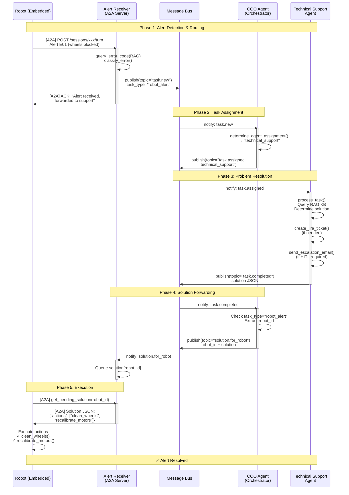
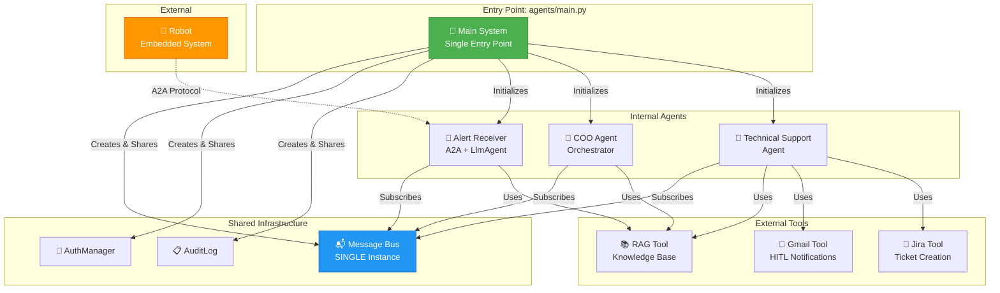
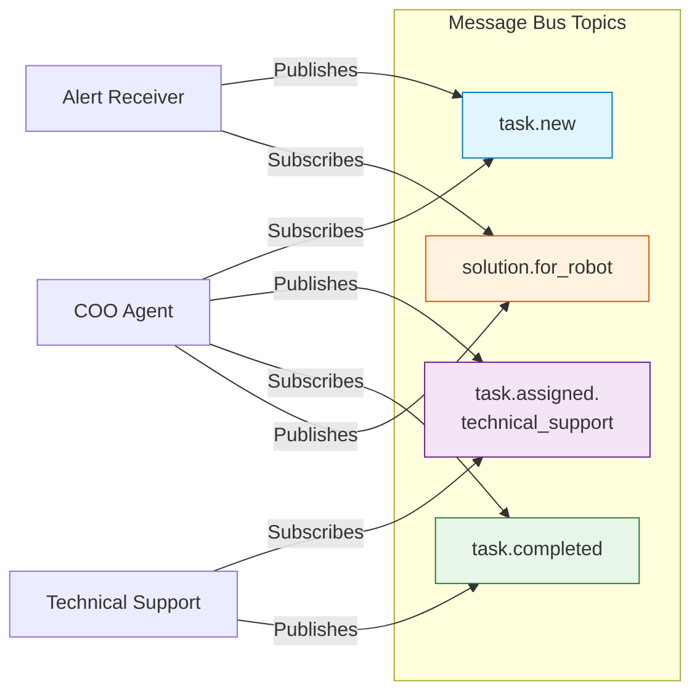

# Architecture Message Bus - RoboNest System

Ce diagramme illustre le workflow complet du système RoboNest utilisant Message Bus pour la communication entre agents.

## Flow Principal: Robot Alert → Resolution



## Architecture des Composants



## Topics Message Bus



## Format des Messages

### task.new (Alert Receiver → COO)
```json
{
  "task_id": "ALERT-XR25-001-1733012345",
  "task_type": "robot_alert",
  "robot_id": "XR25-001",
  "error_code": "E01",
  "severity": "medium",
  "description": "Wheels blocked - unable to move",
  "context": {
    "sensor_data": {
      "battery_level": 85,
      "temperature": 42.5,
      "location": {"x": 10.5, "y": 20.3}
    }
  }
}
```

### task.assigned.technical_support (COO → Technical Support)
```json
{
  "task_id": "ALERT-XR25-001-1733012345",
  "assigned_to": "tech_support_001",
  "task_data": { /* same as task.new */ },
  "assignment_reason": "Robot alert requires technical support"
}
```

### task.completed (Technical Support → COO)
```json
{
  "task_id": "ALERT-XR25-001-1733012345",
  "status": "completed",
  "result": {
    "actions": ["clean_wheels", "recalibrate_motors"],
    "error_code": "E01",
    "ticket_id": "ROB-123",
    "requires_hitl": false,
    "is_temporary_solution": false
  }
}
```

### solution.for_robot (COO → Alert Receiver)
```json
{
  "robot_id": "XR25-001",
  "task_id": "ALERT-XR25-001-1733012345",
  "solution": {
    "actions": ["clean_wheels", "recalibrate_motors"],
    "error_code": "E01",
    "requires_hitl": false
  }
}
```

## Lancement du Système

**Un seul point d'entrée:**
```bash
# Terminal 1 - Système complet (Message Bus + tous les agents)
python agents/main.py

# Terminal 2 - Robot embarqué
python start_robot.py

# Terminal 3 - Console de simulation
python start_simulator.py
```

## Agents et Leurs Rôles

| Agent | Type | Responsabilités | Topics Subscribed | Topics Published |
|-------|------|----------------|-------------------|------------------|
| **Alert Receiver** | LlmAgent + A2A | - Reçoit alertes robot via A2A<br/>- Analyse avec RAG<br/>- Route vers COO | `solution.for_robot` | `task.new` |
| **COO Agent** | Orchestrator | - Routing intelligent<br/>- Délégation de tâches<br/>- Forward solutions | `task.new`<br/>`task.completed` | `task.assigned.*`<br/>`solution.for_robot` |
| **Technical Support** | Resolver | - Résolution problèmes<br/>- Consultation RAG<br/>- Création Jira/Gmail | `task.assigned.technical_support` | `task.completed` |

## Notes Importantes

1. **Message Bus Unique**: Tous les agents partagent la MÊME instance de Message Bus créée dans `agents/main.py`
2. **A2A Exposition**: Alert Receiver est exposé en A2A sur port 8000 pour communication avec le robot
3. **Async Communication**: Flux asynchrone complet via Message Bus
4. **HITL Support**: Technical Support peut escalader vers humains via Gmail + Jira
